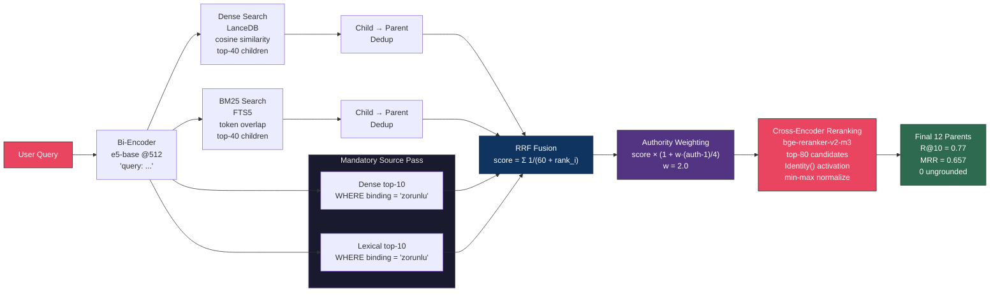
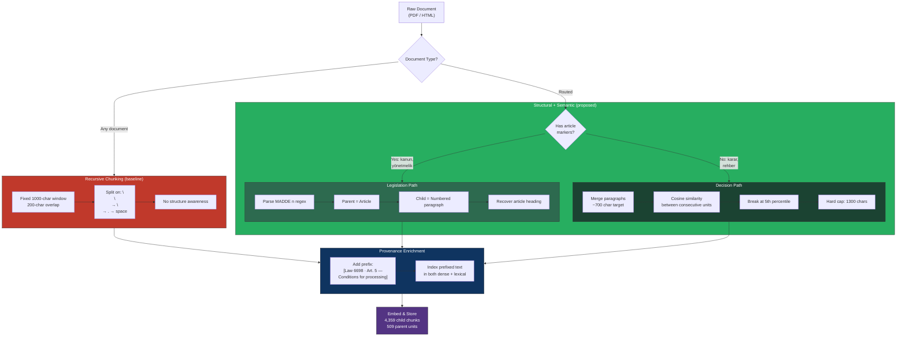
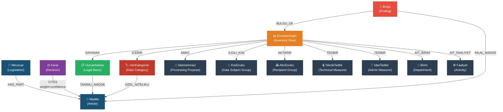
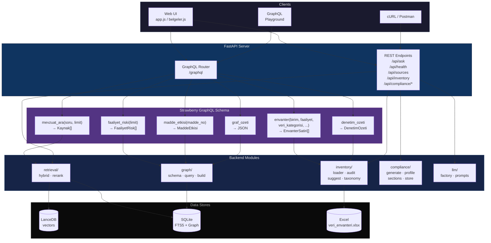
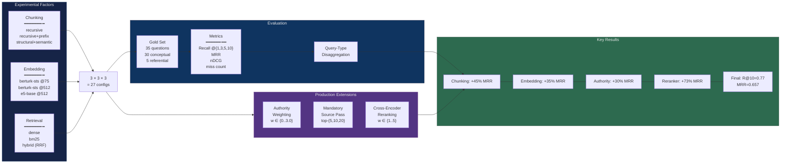
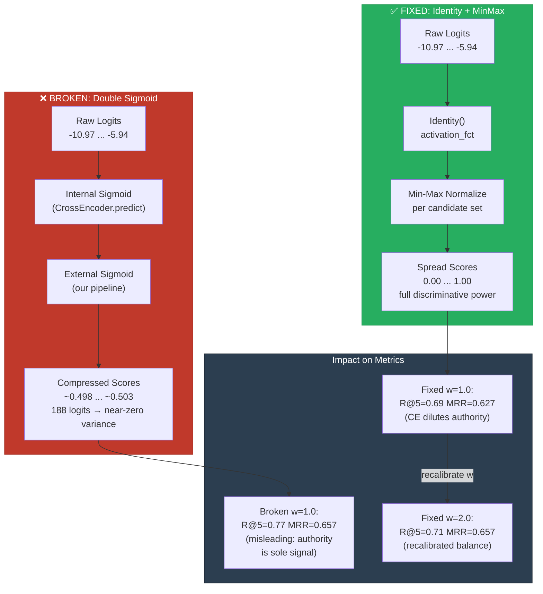

# KVKK-RAG System Architecture Diagrams

> These Mermaid diagrams are designed for inclusion in [paper.tex](file:///c:/Users/yamac/OneDrive/Masaüstü/KVKK-RAG/docs/paper.tex).
>
> **Export instructions:** Render each diagram with [Mermaid Live Editor](https://mermaid.live) or `mmdc` CLI, export as PDF/PNG, and include in LaTeX with `\includegraphics`.

---
## 1. Experimental RAG Pipeline Architecture

The end-to-end experimental architecture from corpus ingestion and indexing to hybrid retrieval, neural reranking, and local LLM generation (excluding web/UI interfaces).

```mermaid
flowchart LR
    subgraph INPUT_STAGE["1. Query & Corpus Preparation"]
        direction TB
        QUERY["User Query<br/>(Conceptual / Referential)"]
        
        subgraph INGESTION["Corpus Ingestion (372 Documents)"]
            direction TB
            RAW_DOCS["Raw Legal Text<br/>(Laws, Regs, Decisions)"]
            CHUNKER["Structure-Aware Chunking<br/>• Legislation: Regex (MADDE n)<br/>• Decisions: Cosine Breakpoints"]
            PARENT_CHILD["Hierarchical Units<br/>Parent: Full Article / Decision<br/>Child: Paragraph with Prefix"]
            RAW_DOCS --> CHUNKER --> PARENT_CHILD
        end
    end

    subgraph INDEX_STAGE["2. Dual-Representation Indexing"]
        direction TB
        BI_ENC["Bi-Encoder<br/>multilingual-e5-base @512<br/>(Prefix: passage:)"]
        DENSE_IDX[("Vector Index<br/>LanceDB<br/>4,359 Child Embeddings")]
        BM25_IDX[("Lexical Index<br/>SQLite FTS5<br/>Tokenized Chunks + Prefixes")]
        
        PARENT_CHILD -.-> BI_ENC --> DENSE_IDX
        PARENT_CHILD -.-> BM25_IDX
    end

    subgraph RETRIEVAL_STAGE["3. Hybrid Retrieval & Scoring"]
        direction TB
        QUERY_ENC["Query Encoding<br/>(Prefix: query:)"]
        
        DENSE_SEARCH["Dense Search<br/>Cosine Similarity<br/>Top-40 Children"]
        BM25_SEARCH["Lexical Search<br/>BM25 Matching<br/>Top-40 Children"]
        MAND_PASS["Mandatory Source Pass<br/>Binding Legislation<br/>Top-10 Guaranteed"]
        
        RRF_FUSION["Reciprocal Rank Fusion<br/>RRF(d) = sum 1 / (60 + rank_i)<br/>Fused Pool"]
        AUTH_WEIGHT["Authority Calibration<br/>Score x (1 + w x (auth-1)/4)<br/>w = 2.0 Multiplier"]

        QUERY --> QUERY_ENC
        QUERY_ENC --> DENSE_SEARCH
        QUERY --> BM25_SEARCH
        QUERY --> MAND_PASS
        
        DENSE_IDX --- DENSE_SEARCH
        BM25_IDX --- BM25_SEARCH
        
        DENSE_SEARCH --> RRF_FUSION
        BM25_SEARCH --> RRF_FUSION
        MAND_PASS --> RRF_FUSION
        RRF_FUSION --> AUTH_WEIGHT
    end

    subgraph RERANK_STAGE["4. Neural Reranking & Resolution"]
        direction TB
        CROSS_ENC["Cross-Encoder<br/>BAAI/bge-reranker-v2-m3<br/>(Raw Logits + Min-Max Norm)"]
        RESOLVE["Parent Deduplication<br/>Aggregate Children to<br/>Top-12 Complete Articles"]
        
        AUTH_WEIGHT -->|"Top-80 Candidates"| CROSS_ENC
        CROSS_ENC --> RESOLVE
    end

    subgraph GEN_STAGE["5. Grounded Generation"]
        direction TB
        PROMPT["Context Assembly<br/>12 Grounded Parent Articles<br/>+ Legal Citation Prompt"]
        LOCAL_LLM["Local LLM<br/>Deterministic Generation<br/>with Exact Statutory Basis"]
        ANSWER["Final Answer<br/>with Article-Level Citations"]

        RESOLVE --> PROMPT --> LOCAL_LLM --> ANSWER
    end
```



---

## 2. Retrieval Pipeline Detail

The scoring and reranking flow for a single query.



---

## 3. Chunking Strategy Comparison

How the two chunking approaches differ.



---

## 4. Knowledge Graph Schema

All node types and edge relationships in the SQLite-backed graph.



---

## 5. GraphQL API Architecture

How the Strawberry GraphQL layer connects to backend modules.



---

## 6. Experiment Design & Evaluation Flow

The 3×3×3 fully crossed experiment matrix.



---

## 7. Double-Sigmoid Defect (Before/After)

The cross-encoder scoring bug and its fix.



---

## How to Include in LaTeX

```bash
# Install mermaid CLI
npm install -g @mermaid-js/mermaid-cli

# Export each diagram to PDF
mmdc -i diagrams.md -o diagram-1.pdf -e pdf
# Or to PNG (300 DPI for print)
mmdc -i diagrams.md -o diagram-1.png -s 3
```

Then in `paper.tex`:
```latex
\begin{figure}[t]
  \centering
  \includegraphics[width=\columnwidth]{figures/architecture.pdf}
  \caption{End-to-end system architecture.}
  \label{fig:architecture}
\end{figure}
```
